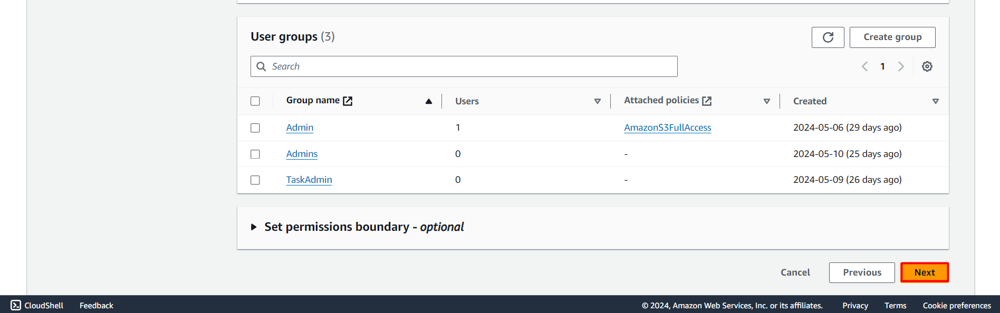
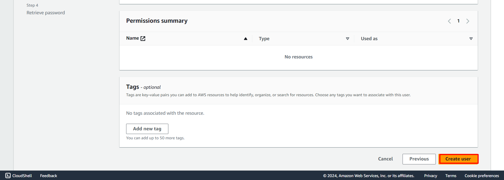

#### Lab Guide 
# To create a IAM-USER in AWS Account 

## Login to AWS Console

Follow the steps below to get started with the lab.
  
1.Sign in to the AWS Management Console by copying the  **Sign-in link**, **Username**, and **Password** provided below.

Or just click [AWS Console](https://aws.amazon.com/console/ )

  - Sign-in Link: https://aws.amazon.com/console/
  - IAM Username:
  - Password:

  

2.You will see a ***AWS_Console.***

.png)

3.Go to ***Search bar.***

4.search for the service ***IAM*** and press **Enter.**

5.You will see a ***IAM Dashboard.***

6 In Left panel select the ***users.***

7.You will see ***users*** window.

8.Now click on the buttom **Create User** present at top right corner. 

9.Once after selecting the **Create User** you will see a window asking you to fill *User Details.*

i.Give Unique ***User Name.***

ii.Check the box *Provide user access to the AWS Management Console - optional.*

iii In *console password* select **Autogenerated Password.** 

iv. Uncheck the *Users must create a new password at next sign-in - Recommended.*

v. Click on ***next*** button present at bottom left corner.

Below are the images where the actions performed for the points i to v

10. In next step you will see ***Set Permission*** tab where you will be assigning permission and policy as of now ignore. And Click ***next***

11. Next tab will be ***Review and create*** tab. Here you can review what all the things you used or did while creating the user. Click on ***Create User.***

12.A user will be created and here you need to save the credentials or can download the *.csv* file.

13. Now in top right corner click ***View user*** you will be navigated to that user details. There you can see that *users* internal details.

14. Now click the ***users*** in left panel. You will see the user you have created.

*YOU HAVE SUCCESSFULLY COMPLETED THE IAM-USER CREATION*.

